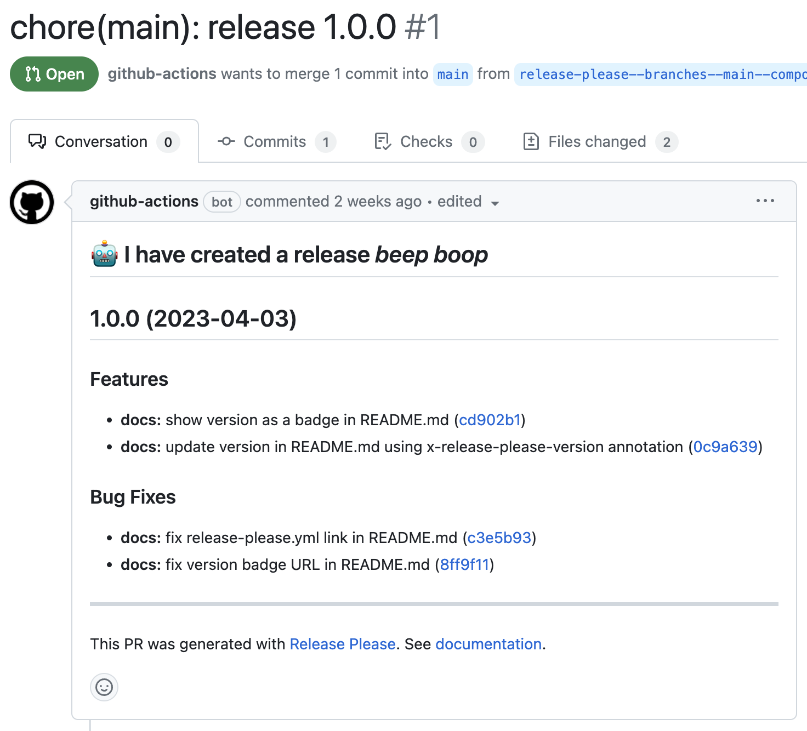
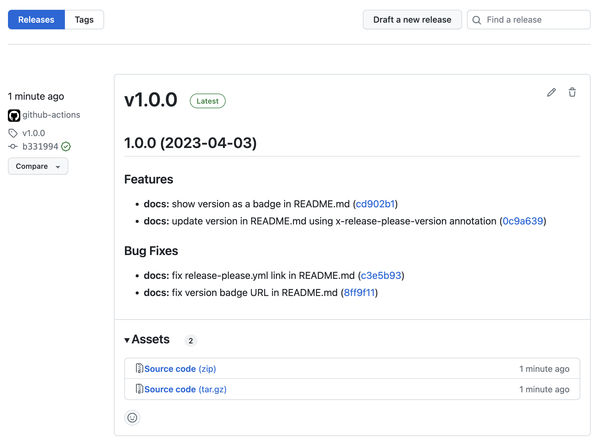

# Release Please Playground

 <!-- x-release-please-version -->

Playing with [Release Please GitHub Action](https://github.com/marketplace/actions/release-please-action).

## Project Goals

1. Learning Release Please GitHub Action on a test repository.
2. Release PRs authored automatically by Release Please.
3. Project CHANGELOG.md generated from Conventional Commits.
4. Automatically updated release versions in arbitrary files.
5. Project GitHub Release with Semantic Versioning and version Git tags.

## Setup

Release Please workflow is configured
in [.github/workflows/release-please.yml](https://github.com/digrec/release-please-playground/blob/main/.github/workflows/release-please.yml)
file.

### Release PR

Release Please maintains Release PRs (like [PR-#1](https://github.com/digrec/release-please-playground/pull/1/files))
for you on each push to main branch. It's up to you when to tag a release by simply merging the release PR.

Later, when you push again to the main branch, new release PR will be automatically created.

### GitHub Release

Once a release PR is merged, Release Please will tag the new release commit and create a corresponding GitHub Release
based on the tag.

### Update Versions

To update versions in arbitrary files, you can use `x-release-please-version` annotation in the form of a line comment
on the line where the version replacement needs to happen.

The arbitrary files that need version replacement must be listed using `extra-files` option in the workflow
configuration [release-please.yml](.github/workflows/release-please.yml) file.

You can see Release Please in action in this [PR-#1](https://github.com/digrec/release-please-playground/pull/1/files),
or read [here](https://github.com/marketplace/actions/release-please-action#adding-additional-files) for more.

#### Android App Versions

My main goal here is to use Release Please to update `versionCode` and `versionName` of an Android application.
See [build.gradle](./build.gradle) on how to use Release Please annotations, like `x-release-please-major`,
to update you app's version name and code.

You can see Release Please in action in this [PR-#2](https://github.com/digrec/release-please-playground/pull/2/files).

The approach for generating version code from version name, I borrowed from
this [Quick Tip: Auto-generate your versionCode](https://proandroiddev.com/quick-tip-auto-generate-your-versioncode-614629f7d3bd)
blog post.
